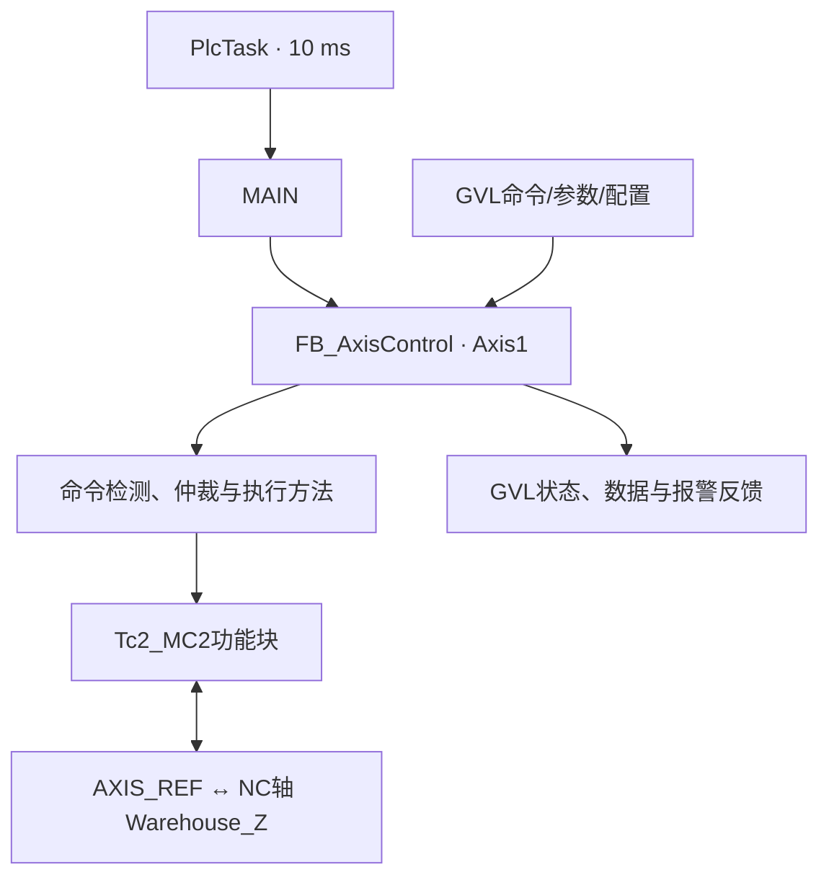

# ZNQ_MoveCtrl PLC项目架构与调用链审查报告

审查对象：`ZNQ_MoveCtrl(20260828-093933).zip`  
审查日期：2026-08-28  
审查范围：PLC源程序、数据类型、GVL、任务配置、NC轴映射、软件限位、命令执行、状态反馈、报警汇总、静态引用关系及编译/Boot产物。

> 本报告属于源码静态审查。压缩包完整性正常，源码之后存在更新的CompileInfo与Boot应用文件，证据与“已重新编译并生成Boot工程”一致；但本次没有在TwinCAT工程环境中重新执行编译、在线运行或真实机械测试。

## 1. 总体结论

当前项目的**活动单轴控制主链路正确、层次清楚、周期调用顺序合理，点动、绝对运动、相对运动、停止、使能、复位、软件限位、错误汇总、状态与实时数据反馈均已形成闭环**。模拟轴基本调试可以继续使用。

本版本已经正确修复此前的软件限位关键问题：

- `M_UpdateSoftLimitState`正确写入`stSoftLimitResult.bReferenceValid`；
- `M_ExecuteJog`和`M_ExecutePositioning`正确区分`bConfigValid`与`bReferenceValid`；
- 相对运动目标按`NcToPlc.SetPos + fRelativeDistance`计算，与`MC_MoveRelative`以当前设定位置为基准的行为一致；
- PLC软件限位与NC轴软件限位均启用，当前范围均与`0.0～600.0`一致；
- `AxisRef.ReadStatus()`位于轴控制周期最前面，并且当前只有一个`FB_AxisControl`实例调用该轴，调用位置正确；
- 所有MC功能块均保持周期调用，没有把功能块调用放在一次性条件分支中；
- `MC_Stop`使用跨周期Execute锁存，并在请求释放、轴停止后撤销Execute，符合其锁轴/解锁语义。

不过，若把“项目内所有已声明功能均完整实现”作为标准，则目前还不能判定为完全完成。主要剩余项如下：

| 等级 | 结论 | 影响 |
|---|---|---|
| 中 | `ST_AxisLimit`中的速度、加速度、减速度上下限尚未参与校验 | 当前只检查速度大于0、加减速度不小于0，上位机仍可输入超大动态参数 |
| 中 | `State.bReady`未包含`stSoftLimitResult.bReady` | 软限位配置无效或要求回零但未回零时，界面可能显示Ready，但运动命令会被拒绝 |
| 中 | 点动缓冲距离是固定5.0，没有按速度、减速度和扫描延迟校验制动距离 | 当前低速模拟值风险较低；更高速度或更小减速度下不能仅依赖该Margin保证在PLC边界前停稳 |
| 低 | `ST_AxisControlInternal`已经创建但没有在`FB_AxisControl`中实例化使用 | 不影响运行，但该结构体当前属于冗余定义，FB声明区仍保留7个散变量 |
| 低 | `bDone`只汇总复位和两种定位完成，没有反馈Stop完成或Jog停止完成 | “最近命令完成”的语义不完整，后续WPF可能无法统一判断各动作结束 |
| 低 | 多个枚举成员、结构体字段、GVL及空FB为未来预留，当前没有调用 | 不影响最小单轴调试，但增加阅读范围和“功能已实现”的误解风险 |
| 低 | `fActRpm`固定写0.0 | 当前数据结构有转速字段，但尚无工程单位到rpm的换算参数 |
| 低 | 部分注释与实际配置不一致 | `GVL_AxisConfig`仍写“保持FALSE”“-1000～1000”，实际为TRUE和0～600 |

因此建议将当前版本定义为：

> **最小单轴模拟调试版本：通过；物理设备通用调试版本：有条件通过；生产设备安全控制版本：尚未完成。**

## 2. 审查方法与证据

本次完成了以下检查：

1. ZIP完整性检查：压缩包内文件均可正常解压；
2. PLC项目清单检查：DUT、GVL、POU、Task均已被`inovance_ctrl.plcproj`纳入编译；
3. 静态调用检查：从`PlcTask`到`MAIN`、`FB_AxisControl`、各方法和MC功能块逐级核对；
4. 静态引用检查：查找只声明未引用的类型、FB、GVL和字段；
5. NC映射检查：确认`GVL_AxisRef.Axis1Ref.PlcToNc/NcToPlc`与`Warehouse_Z`轴双向映射；
6. 周期检查：PLC任务为10 ms，NC SAF任务为2 ms，NC SVB任务为10 ms；
7. 构建时间检查：`FB_AxisControl.TcPOU`时间为16:46:32，CompileInfo为16:49:10/16:49:46，Boot应用为16:49:46，构建产物晚于本次核心源码；
8. 与Beckhoff官方行为核对：`ReadStatus`、`MC_Jog`、`MC_Stop`、`MC_MoveRelative`及NC软件限位的关键语义均与当前活动逻辑相符。

## 3. 当前层级架构



### 3.1 层级职责

| 层级 | 主要文件 | 职责 | 评价 |
|---|---|---|---|
| L0 系统/NC配置 | `ZNQ_MoveCtrl.tsproj` | NC轴、任务周期、轴参数、PLC/NC映射 | 配置有效，AxisRef映射完整 |
| L1 类型层 | `01_Types` | 定义命令、参数、数据、状态、报警、限位及内部结果 | 分类清晰；存在未来预留类型 |
| L2 全局对象层 | `02_GVLs` | 轴引用、轴配置、运行接口 | 最小单轴结构直观；HMI/System为空 |
| L3 单轴组件层 | `FB_AxisControl` | 单轴命令仲裁、MC执行、限位、错误和反馈 | 项目核心，职责集中且方法化良好 |
| L4 编排层 | `MAIN` | 实例化并绑定一根轴 | 极简、清楚；控制许可暂时硬编码TRUE |
| L5 调度层 | `PlcTask.TcTTO` | 每10 ms调用`MAIN` | 调用链入口明确 |
| 预留业务层 | AxisManager/SystemControl/Sequences | 未来多轴、系统管理和工艺流程 | 当前均为空且未实例化 |

架构方向是合理的：数据类型与全局实例分离，单轴控制封装在一个功能块内，`MAIN`只负责绑定和调用。当前最明显的架构不一致是：已经创建`ST_AxisControlInternal`，但`FB_AxisControl`仍直接声明`bMotionActive`、`bStopRequest`、`bAnyBusy`、`eRequestedCommand`和三个Execute锁存变量。

## 4. 每个程序文件的作用与完整性

### 4.1 枚举类型

| 文件 | 当前作用 | 引用状态 | 审查结论 |
|---|---|---|---|
| `E_AxisCommand.TcDUT` | 命令仲裁结果 | 活动使用 | `NoCommand/Reset/Stop/MoveRelative/MoveAbsolute/JogPositive/JogNegative`已使用；`PowerOn/PowerOff/Halt/Home/TorqueControl`未实现 |
| `E_AxisControlMode.TcDUT` | 位置/速度/力矩模式枚举 | 未使用 | 当前冗余，可保留作扩展或移出最小版本 |
| `E_AxisErrorSource.TcDUT` | 锁存错误来源 | 活动使用 | Power、Reset、Move、Jog、Stop、NcAxis已使用；其余为预留；Jog注释仍写`MC_MoveVelocity`，应改为`MC_Jog` |
| `E_AxisMotionState.TcDUT` | 统一轴运动状态 | 活动使用 | Disabled、NotReady、Standstill、Moving、Jogging、Stopping、Resetting、Error已使用；Homing、TorqueRunning未实现 |
| `E_AxisRejectReason.TcDUT` | 命令拒绝原因 | 活动使用 | 当前拒绝场景覆盖较完整；`HomeNotAllowed`暂未使用 |

### 4.2 接口与参数结构体

| 文件 | 当前作用 | 完整性结论 |
|---|---|---|
| `ST_AxisInterface.TcDUT` | 汇总Cmd、Set、Data、State、Alarm | 结构清晰，适合作为当前ADS单轴接口 |
| `ST_AxisCmd.TcDUT` | Enable、Reset、Stop、绝对/相对、正/负点动命令 | 当前已全部进入调用链；定位/复位为上升沿，点动/使能/停止为持续电平 |
| `ST_AxisSet.TcDUT` | 汇总Jog与Position参数 | 清晰且无重复 |
| `ST_AxisJogSet.TcDUT` | 点动速度、加速度、减速度 | 够用；没有Jerk，当前统一传0使用NC默认Jerk |
| `ST_PositionSet.TcDUT` | 绝对位置、相对距离及公共动态参数 | 绝对/相对共享动态参数、分开保存目标，设计合理 |
| `ST_AxisData.TcDUT` | 位置、速度、加速度、跟随误差、力矩、转速反馈 | 除`fActRpm`外均有实际数据源；rpm暂固定0 |
| `ST_AxisState.TcDUT` | Ready、Power、Homed、Busy、Active、结果、运动状态、软限位状态 | 基本全面；`bDone`动作范围不完整，Ready与软限位Ready存在语义不一致 |
| `ST_AxisAlarm.TcDUT` | 锁存错误、警告、拒绝原因 | 错误和拒绝已使用；Warning当前每周期清零且没有生产者 |
| `ST_AxisInterlock.TcDUT` | 回零、方向、总许可、抱闸互锁预留 | 未使用，当前不会保护运动 |

### 4.3 限位与内部结构体

| 文件 | 当前作用 | 完整性结论 |
|---|---|---|
| `ST_AxisLimit.TcDUT` | 轴配置上限集合 | 软件位置限位、Margin、RequireHomed已使用；动态上下限、力矩限值、跟随误差阈值均未使用 |
| `ST_AxisSoftLimitResult.TcDUT` | 保存每周期软件限位计算结果 | 使用正确，职责单一，**不需要再套一层结构体** |
| `ST_AxisControlInternal.TcDUT` | 计划汇总FB内部共享状态 | 当前没有任何实例或字段引用；要么真正替换FB散变量，要么暂时删除该DUT |

### 4.4 GVL

| 文件 | 当前作用 | 完整性结论 |
|---|---|---|
| `GVL_AxisRef.TcGVL` | 声明`Axis1Ref` | 已与NC轴双向链接，活动使用 |
| `GVL_AxisConfig.TcGVL` | 保存Axis1软件限位配置 | 活动使用；配置为启用、0～600、Margin 5、不要求回零；注释需同步更新 |
| `GVL_AxisRuntime.TcGVL` | 保存命令、设置、实时数据、状态和报警 | 活动使用，是当前PLC/WPF共享接口 |
| `GVL_HMI.TcGVL` | HMI专用变量预留 | 空、未使用 |
| `GVL_System.TcGVL` | 系统状态预留 | 空、未使用 |

### 4.5 POU与任务

| 文件 | 当前作用 | 调用状态 | 完整性结论 |
|---|---|---|---|
| `FB_AxisControl.TcPOU` | 所有活动单轴控制逻辑 | 由MAIN每周期调用 | 核心链完整，方法分工清楚；仍有上述中低级改进项 |
| `MAIN.TcPOU` | 实例化Axis1控制并绑定GVL | 由PlcTask调用 | 正确；`bControlAllowed := TRUE`仅适合当前调试阶段 |
| `PlcTask.TcTTO` | 10 ms周期调用MAIN | 活动 | 正确 |
| `FB_AxisManager.TcPOU` | 多轴管理预留 | 未调用、空 | 当前冗余 |
| `FB_AlarmManager.TcPOU` | 系统报警管理预留 | 未调用、空 | 当前冗余 |
| `FB_HmiWatchdog.TcPOU` | HMI心跳监视预留 | 未调用、空 | 当前冗余 |
| `FB_ModeManager.TcPOU` | 模式管理预留 | 未调用、空 | 当前冗余 |
| `FB_SafetyManager.TcPOU` | 系统安全许可预留 | 未调用、空 | 当前冗余；不能把空FB视为已有安全功能 |
| `FB_InitializationSequence.TcPOU` | 初始化流程预留 | 未调用、空 | 与当前单轴调试无关 |
| `FB_AdjustmentSequence.TcPOU` | 调整流程预留 | 未调用、空 | 与当前单轴调试无关 |
| `FB_LoadingSequence.TcPOU` | 上料流程预留 | 未调用、空 | 与当前单轴调试无关 |

### 4.6 工程与生成文件

| 文件/目录 | 作用 | 结论 |
|---|---|---|
| `ZNQ_MoveCtrl.tsproj` | TwinCAT系统、NC、PLC实例和映射配置 | 活动配置核心文件 |
| `inovance_ctrl.plcproj` | PLC编译项目清单和库引用 | 所有当前DUT/GVL/POU/Task均已列入 |
| `inovance_ctrl.tmc` | PLC符号与类型描述 | 生成文件，供映射/ADS符号使用 |
| `_CompileInfo` | 编译信息 | 生成时间晚于核心源码 |
| `_Boot/TwinCAT RT (x64)` | 运行时Boot工程 | 存在最新`Port_851.app`及autostart等文件 |
| `.slnx`、TrialLicense、UpgradeLog、`.vs` | 解决方案、许可证/升级记录、IDE缓存 | 不属于运行调用链 |

## 5. FB_AxisControl每周期完整调用顺序

当前顺序如下，层级与数据依赖正确：

1. `AxisRef.ReadStatus()`：刷新`AXIS_REF.Status`；
2. `M_ClearCycleResults`：清除上一周期Done/Aborted/Rejected、拒绝原因和Warning；
3. `M_UpdateCommandEdges`：更新Reset、MoveAbs、MoveRel及两个Jog的上升沿；
4. `M_UpdateSoftLimitState`：校验限位配置/坐标基准，计算点动方向许可和定位目标合法性；
5. 汇总`bMotionActive`：读取上一周期MC Busy及定位Execute锁存；
6. 生成`bStopRequest`：外部Stop、运动中控制许可撤销、运动中使能撤销；
7. `M_SelectCommand`：按Stop > Reset > Jog > Position进行唯一命令仲裁；
8. 锁存`bStopExecute`；
9. `M_ExecutePowerReset`：周期调用`MC_Power`和`MC_Reset`；
10. `M_ExecuteJog`：周期调用`MC_Jog`；
11. `M_ExecutePositioning`：周期调用`MC_MoveAbsolute`和`MC_MoveRelative`；
12. `M_ExecuteStop`：最后周期调用`MC_Stop`，保证停止取得最终控制权；
13. `M_UpdateError`：读取本周期最新MC输出并锁存最高优先级错误；
14. `M_UpdateBasicState`：汇总Power/Busy/Active/Ready/Homed；
15. `M_UpdateMotionState`：生成唯一运动状态；
16. `M_UpdateAxisData`：更新位置、速度、加速度、跟随误差和力矩。

说明：源码注释中的步骤号有两个“3”，只是编号问题，不影响执行。

## 6. 所有操作的调用链

### 6.1 轴使能

`GVL_AxisRuntime.Axis1.Cmd.bEnable`  
→ `MAIN.stAxis`绑定  
→ `FB_AxisControl.M_ExecutePowerReset`计算`bPowerEnable`  
→ `MC_Power.Enable`  
→ `fbPower.Status`  
→ `M_UpdateBasicState`写入`State.bPowerStatus/bReady`  
→ `M_UpdateMotionState`写入Disabled/Standstill等状态。

运动中撤销Enable时不会直接切断软件使能：先产生Stop请求，`MC_Power`在`MC_Stop`锁存或Busy期间保持使能，待Stop解锁完成后才撤销Power，时序设计正确。

### 6.2 错误复位

`Cmd.bReset`上升沿  
→ `M_UpdateCommandEdges.trigReset.Q`  
→ `M_SelectCommand = Reset`  
→ `M_ExecutePowerReset`检查无运动、无Stop  
→ `MC_Reset`  
→ Done时清除PLC锁存错误并置单周期`State.bDone`  
→ `M_UpdateError/M_UpdateBasicState/M_UpdateMotionState`更新最终反馈。

### 6.3 正向/负向点动

`Cmd.bJogPos`或`Cmd.bJogNeg`持续TRUE  
→ `M_UpdateCommandEdges`生成一次拒绝检测上升沿  
→ `M_SelectCommand`持续输出Jog方向  
→ `M_UpdateSoftLimitState`给出正/负方向许可  
→ `M_ExecuteJog`校验Power、控制许可、报警、Stop、其他运动、动态参数及限位  
→ `MC_Jog(JogForward/JogBackwards, CONTINOUS)`  
→ 松开按钮或限位许可撤销后对应方向输入FALSE并减速停止  
→ `M_UpdateError/M_UpdateBasicState/M_UpdateMotionState/M_UpdateAxisData`反馈。

### 6.4 绝对运动

WPF/调试变量先写`Set.Position.fAbsolutePosition`和动态参数  
→ `Cmd.bMoveAbs`产生上升沿  
→ `M_UpdateSoftLimitState`检查绝对目标位于0～600  
→ `M_SelectCommand = MoveAbsolute`  
→ `M_ExecutePositioning`检查许可、动态参数、限位状态  
→ 锁存`bMoveAbsExecute`  
→ `MC_MoveAbsolute(Execute := bMoveAbsExecute)`  
→ Done/CommandAborted/Error时清除Execute  
→ 更新结果、报警、状态与实时数据。

PLC不会把`Cmd.bMoveAbs`本身自动写回FALSE；它只清除内部`bMoveAbsExecute`。因此外部命令仍应采用“TRUE保持50～100 ms后写一次FALSE”的脉冲协议，下一次命令才能再次形成上升沿。

### 6.5 相对运动

WPF/调试变量先写`Set.Position.fRelativeDistance`和动态参数  
→ `M_UpdateSoftLimitState`计算`NcToPlc.SetPos + fRelativeDistance`  
→ `Cmd.bMoveRel`上升沿  
→ `M_SelectCommand = MoveRelative`  
→ `M_ExecutePositioning`检查最终绝对目标  
→ 锁存`bMoveRelExecute`  
→ `MC_MoveRelative`  
→ Done/CommandAborted/Error时清除Execute  
→ 更新结果、报警、状态与实时数据。

绝对位置输入框和相对距离输入框互不替代：点击绝对运动只读取`fAbsolutePosition`，点击相对运动只读取`fRelativeDistance`。

### 6.6 停止

以下任一条件成立：

- `Cmd.bStop = TRUE`；
- 运动中`bControlAllowed = FALSE`；
- 运动中`Cmd.bEnable = FALSE`。

调用链为：

停止条件  
→ `bStopRequest`  
→ `M_SelectCommand = Stop`  
→ 锁存`bStopExecute`  
→ Jog许可撤销、Move Execute清除  
→ 最后调用`MC_Stop`  
→ `fbStop.Done AND NOT bStopRequest`时清除`bStopExecute`  
→ 下一周期Execute下降沿，MC_Stop继续周期调用直到Busy解除  
→ 状态从Stopping回到Standstill/Disabled。

该实现符合`MC_Stop`必须在停止后撤销Execute才能解除轴锁定的要求。

### 6.7 软件限位

`GVL_AxisConfig.Axis1Limit`  
→ `MAIN.stLimit`  
→ `M_UpdateSoftLimitState`  
→ `ST_AxisSoftLimitResult`  
→ 点动方向许可 / 绝对目标检查 / 相对最终目标检查  
→ `State.bSoftLimitEnabled/Ready/Positive/Negative`。

当前是两层功能保护：

1. PLC层在命令进入MC功能块前拒绝越界定位，并在点动进入Margin区域后撤销向外点动；
2. NC轴层启用最小/最大软件限位，范围与PLC配置一致。

注意：NC软件限位和PLC软件限位都是功能性限制，不属于安全技术意义上的安全功能，不能替代STO、安全限位、硬限位开关或风险评估。

### 6.8 错误、状态与数据反馈

`AxisRef.ReadStatus + 各MC功能块输出`  
→ `M_UpdateError`按NC > Stop > Power > Reset > Jog > MoveAbs > MoveRel锁存  
→ `M_UpdateBasicState`汇总基础状态  
→ `M_UpdateMotionState`生成唯一状态  
→ `M_UpdateAxisData`读取NcToPlc实时数据  
→ `GVL_AxisRuntime.Axis1.Alarm/State/Data`。

## 7. 关键逻辑审查

### 7.1 正确项

- `ReadStatus()`在周期首部且仅由当前单轴FB调用一次；
- R_TRIG统一在一个方法中每周期调用一次；
- Stop、Reset、Jog、Position优先级明确；
- 绝对/相对命令冲突和正/负Jog冲突均有拒绝反馈；
- 普通定位使用Execute跨周期锁存，在Done/Abort/Error/Stop时释放；
- 运动中撤销使能会先Stop再Power Off；
- Jog与Position不会与Reset、Stop或其他运动功能块同时获得许可；
- 软件限位禁用时不阻止运动，启用但配置/参考无效时采用失效安全方式阻止普通运动；
- 已经超出某侧限位时，程序阻止继续向外，同时允许反方向返回；
- 目标超限采用“拒绝整条命令”而不是自动钳位到边界，可避免误输入多一个0后产生意外长距离运动；
- Error为锁存量，拒绝原因、Done、Aborted、Rejected为单周期结果，职责区分合理。

### 7.2 需要改进但不阻塞当前模拟测试的项

#### A. 动态参数上下限没有落地

当前检查只有：

- Velocity > 0；
- Acceleration >= 0；
- Deceleration >= 0。

`ST_AxisLimit.fMinVelocity/fMaxVelocity/...`没有任何引用，`GVL_AxisConfig.Axis1Limit`也没有初始化这些值。建议下一阶段先给每根轴定义真实工程上下限，再让Jog和Position统一调用参数校验方法。否则结构体注释中的“限制上位机输入、保护机械结构”尚未实现。

#### B. Ready语义需要统一

当前`State.bReady`可能在以下情况下仍为TRUE：

- PLC软限位已启用但上下限/Margin配置错误；
- `bRequireHomed = TRUE`但轴尚未Homed。

然而Jog和Position会拒绝这些命令。建议在定义上二选一：

1. 若`bReady`表示“可以接受普通运动”，加入`AND stSoftLimitResult.bReady`；
2. 若`bReady`只表示“轴使能、无报警且空闲”，保留逻辑，但改名或明确注释，并由WPF同时读取`bSoftLimitReady`。

推荐方案1，界面语义更直接。

#### C. Jog Margin不是自动制动距离

5.0工程单位对当前Jog速度5、减速度500很宽裕，但程序没有验证：

`Margin >= v²/(2a) + 扫描与NC响应距离 + 安全余量`

如果日后把Jog速度大幅提高或减速度降低，需要重新计算Margin。NC层0～600软件限位提供第二层功能保护，但也不是安全功能。

#### D. 统一结果反馈不完整

`State.bDone`目前由Reset、MoveAbsolute、MoveRelative置位；Stop完成没有置位，Jog松开后也没有“停止完成”事件。若后续WPF要统一显示命令完成，建议增加`eLastAcceptedCommand/eLastCompletedCommand`、命令序号与结果序号，或分别提供动作结果，而不是继续扩大一个无来源信息的`bDone`。

另外，当前Done/Rejected/Aborted只保持一个10 ms PLC周期，典型WPF ADS轮询可能漏读。通信层完善时应采用握手、序号或锁存确认机制。

#### E. 内部结构体尚未真正使用

`ST_AxisControlInternal`的字段与FB内散变量一一对应，但FB没有声明类似：

```iecst
stInternal : ST_AxisControlInternal;
```

因此该DUT当前完全冗余。若继续封装，应统一替换为`stInternal.bMotionActive`等字段；`stSoftLimitResult`已经是独立的单一职责结果结构，不建议再嵌入一层仅为了减少变量数量。

#### F. 回零、互锁和真实安全许可尚未接入

当前模拟轴明确设置`bRequireHomed := FALSE`，所以绝对运动可用于模拟测试。接入增量编码器物理轴时，需要至少补充：

- `MC_Home`或其他坐标建立流程；
- `ST_AxisInterlock`到Jog/Position/Stop许可链；
- 硬限位、急停、STO、安全门和驱动Ready等真实信号；
- 将`MAIN`中的`bControlAllowed := TRUE`替换为系统许可结果。

## 8. 未调用或冗余程序汇总

### 8.1 完全未调用/未实例化

- `FB_AxisManager`
- `FB_AlarmManager`
- `FB_HmiWatchdog`
- `FB_ModeManager`
- `FB_SafetyManager`
- `FB_InitializationSequence`
- `FB_AdjustmentSequence`
- `FB_LoadingSequence`
- `GVL_HMI`
- `GVL_System`
- `E_AxisControlMode`
- `ST_AxisInterlock`
- `ST_AxisControlInternal`

这些内容不会影响当前程序执行。若目标是保持“最小单轴调试工程”，可以移到`Future/Reserved`目录或从当前工程移除；若后续马上扩展整机控制，也可以保留，但建议统一标注“未实现/未调用”。

### 8.2 部分使用

- `E_AxisCommand`：PowerOn、PowerOff、Halt、Home、TorqueControl未使用；
- `E_AxisErrorSource`：Home、Halt、Parameter、Interlock、Drive、EtherCAT、HmiCommunication、MotionTimeout、Safety、TorqueControl、Brake未使用；
- `E_AxisMotionState`：Homing、TorqueRunning未使用；
- `E_AxisRejectReason`：HomeNotAllowed未使用；
- `ST_AxisLimit`：动态上下限、力矩限值、跟随误差阈值/延时未使用；
- `ST_AxisAlarm`：Warning字段没有生产逻辑；
- `ST_AxisData.fActRpm`：每周期固定为0。

### 8.3 所有活动方法均已调用

`FB_AxisControl`内的12个方法均由FB主体直接调用或参与表达式调用，没有孤立方法：

- `M_ClearCycleResults`
- `M_UpdateCommandEdges`
- `M_UpdateSoftLimitState`
- `M_SelectCommand`
- `M_ExecutePowerReset`
- `M_ExecuteJog`
- `M_ExecutePositioning`
- `M_ExecuteStop`
- `M_UpdateError`
- `M_UpdateBasicState`
- `M_UpdateMotionState`
- `M_UpdateAxisData`

注：源码此前常称“四个执行方法”，是指PowerReset、Jog、Positioning、Stop四个动作执行方法，不是全部方法数量。

## 9. 建议的修改优先级

### 当前模拟调试前

1. 更新`GVL_AxisConfig`中的过期注释；
2. 明确`ST_AxisControlInternal`是立即使用还是暂时删除；
3. 明确`bReady`是否包含软件限位Ready。

### 接入真实电机前

1. 初始化并实施速度/加速度/减速度上下限；
2. 根据真实最大Jog速度和最小减速度计算Margin；
3. 加入回零/坐标建立；
4. 接入硬限位、驱动Ready、STO/急停和机械互锁；
5. 用真实系统许可替代恒TRUE的`bControlAllowed`；
6. 确认NC与PLC限位范围、轴方向、缩放单位完全一致。

### WPF通信接入时

1. 定位和Reset命令使用有限宽度TRUE脉冲，并写一次FALSE恢复；
2. Jog使用按下TRUE、松开FALSE，同时处理鼠标离开、窗口失焦和异常断连；
3. Stop采用持续电平，解除后写FALSE；
4. 对Done/Rejected/Aborted增加命令序号或确认握手，避免10 ms单周期信号漏读；
5. 运动期间锁定或快照化本次命令参数，避免界面修改参数后显示值与活动MC命令不一致。

## 10. 推荐验证用例

| 类别 | 用例 | 期望结果 |
|---|---|---|
| Power | 静止使能/撤销使能 | PowerStatus正确切换 |
| Power+Stop | 运动中撤销Enable | 先Stopping，解锁完成后Disabled |
| Jog | 正/负点动按下与松开 | 按住运动、松开减速停止 |
| Jog限位 | 分别接近5与595 | 仅禁止继续向外，允许反向返回 |
| 定位边界 | Abs目标0、600、-0.1、600.1 | 边界接受，越界拒绝且不自动钳位 |
| 相对边界 | 从不同SetPos给定正/负距离 | 按最终绝对目标正确接受/拒绝 |
| 限位配置 | Min>=Max、Margin<0、2×Margin>=行程 | SoftLimitReady=FALSE，普通运动拒绝 |
| 回零要求 | RequireHomed TRUE且Homed FALSE | Jog/Position拒绝为NotHomed |
| 冲突 | Jog正负同时、Abs/Rel同周期上升沿 | 对应Conflict拒绝 |
| Stop | Jog/Abs/Rel期间触发Stop并保持/释放 | 命令中止、轴停止、释放后解锁 |
| Reset | 静止错误复位、运动中复位 | 静止执行；运动中拒绝 |
| 错误 | 分别制造NC/各MC错误 | ErrorSource与ErrorID优先级正确 |
| 通信 | 50～100 ms定位脉冲 | 只产生一次上升沿，完成后可再次触发 |

## 11. 最终判定

| 审查项目 | 判定 |
|---|---|
| PLC任务到MAIN调用 | 正常 |
| MAIN到单轴FB绑定 | 正常 |
| AXIS_REF与NC轴映射 | 正常 |
| ReadStatus调用位置 | 正常 |
| 命令上升沿与仲裁 | 正常 |
| MC功能块周期调用 | 正常 |
| 使能/复位链 | 正常 |
| Jog链 | 正常 |
| 绝对/相对链 | 正常 |
| Stop锁存与解锁链 | 正常 |
| PLC软件限位核心逻辑 | 正常 |
| NC与PLC限位一致性 | 当前一致 |
| 错误、状态、数据反馈链 | 完整，但Ready/Done语义可完善 |
| 未调用冗余识别 | 已明确 |
| 最小模拟单轴调试 | 满足 |
| 真实物理轴通用调试 | 需补参数上限、回零和互锁 |
| 安全功能 | 不满足，且NC/PLC软限位不能作为安全功能 |

## 12. 官方参考

- Beckhoff：AXIS_REF与ReadStatus  
  https://infosys.beckhoff.com/content/1033/tcplclib_tc2_mc2/70132363.html
- Beckhoff：MC_Jog  
  https://infosys.beckhoff.com/content/1033/tcplclib_tc2_mc2/70120459.html
- Beckhoff：MC_Stop  
  https://infosys.beckhoff.com/content/1033/tcplclib_tc2_mc2/70108555.html
- Beckhoff：MC_MoveRelative  
  https://infosys.beckhoff.com/content/1033/tcplclib_tc2_mc2/70096267.html
- Beckhoff：NC软件限位  
  https://infosys.beckhoff.com/content/1033/tf50x0_tc3_nc_ptp/12544391947.html
